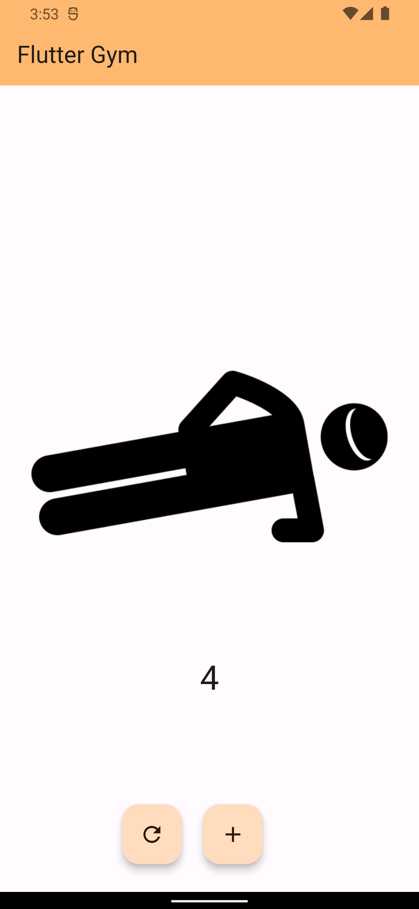
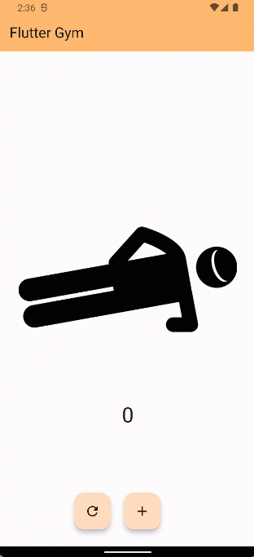

# 🏋️ Flutter Counter
## Sobre o projeto

 💪🏼 Um aplicativo de contador básico desenvolvido em Flutter para o Dio Lab.

## Screenshots

### Tecnologias utilizadas

* Flutter
* Provider
* Testes Unitários

### Desenvolvedora

Jusy Lopes
https://www.linkedin.com/in/jusylopes
